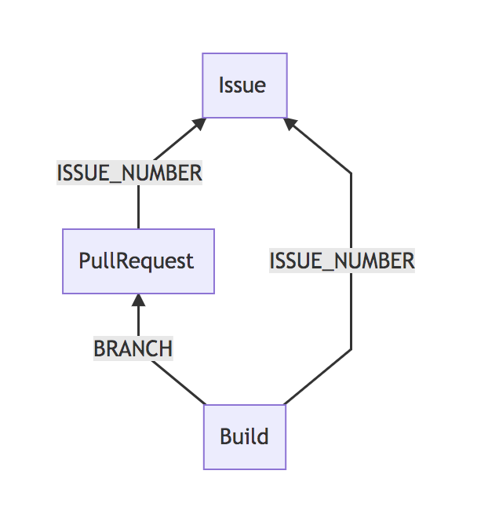
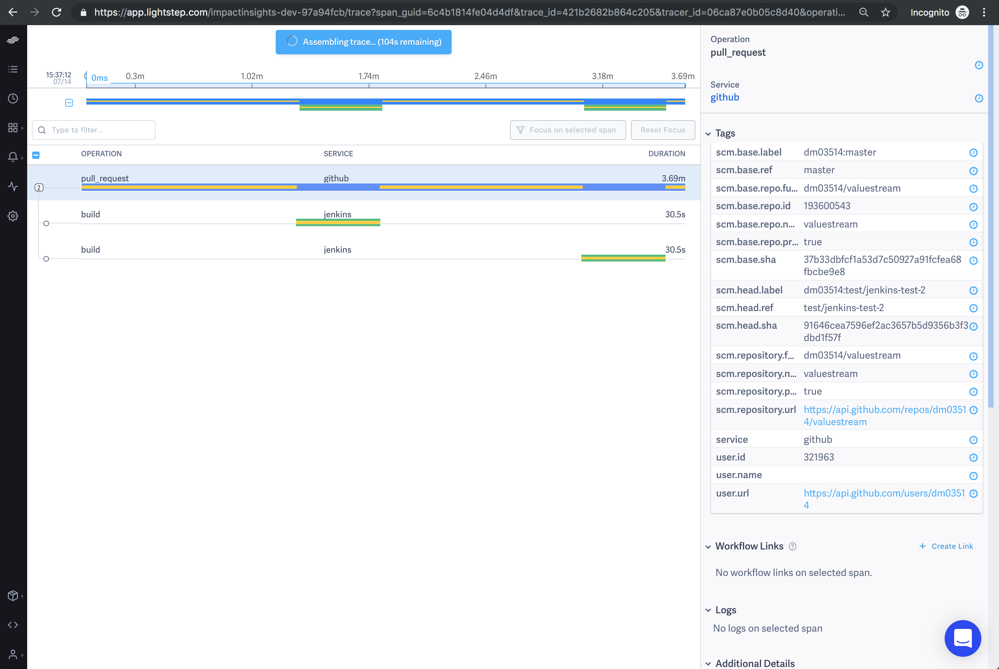

<p align="center">
  
</p>

One Service. One View. All your tools.

[ValueStream](https://medium.com/@dm03514/valuestream-devops-metrics-observing-delivery-across-multiple-systems-7ae76a6e8deb) provides a centralized view into key DevOps delivery metrics: Issues, Pull Requests, Builds and Deploys. If you’ve ever wondered how long tickets are open, or how long deployments take or the success rate of deployments, or the duration of pull requests, ValueStream can help you.  ValueStream is a standalone HTTP service that listens for events (webhooks) from Github and Jenkins. ValueStream ships as a standalone service and using it is as easy as: 

- Starting valuestream and point it to an opentracing compliant backend (jaeger, lightstep, datadog, etc)
- Configuring github/jenkins webhook to point to value stream

ValueStream can help answer:
- What's the average/distribution time of open issues (per project, type, etc)?
- What's the average/distribution of build times (per project, type, etc)?
- What's the average/distribution of deploy times (per project, type, etc)?
- What's the average/distribution of pull request times (per project, repo, etc)?
- What's the deployment rate (per project, type, etc)?
- What's the deployment success ratio (per project, type, etc)?

# ValueStream In Action

ValueStream aggregates data from multiple different system and stores it in a standardize data model based on opentracing specification.  Having a standard data model allows for drilling down into individual integrations (think looking at just github pull request metrics) as well as providing cross service view (Tracing delivery time across multiple systems).  

## Devops Metrics

Valuestream is able to provide a cross system view into software development.  The dashboard below shows the average lead time across all issues from all systems (currently only Github issues are supported). The magic of having a standardized data model enables the view below to seamlessly work for github issues, jira issues, trello issues, or any other system that supports webhooks.  To drive this home consider a company that has code in both Github and Gitlab.  ValueStream can provide the average pull request duration across both github and gitlab, as well as the average across just github or just gitlab.  It even supports drilling down further by providing the average pull request duration by repo across both github and gitlab.

<p align="center">
  
</p>

## Traces

The real power of value stream comes from being able to tie together all the Delivery events (Issue, PRs, Builds & Deploys) from different sources.  When events are connected it is called a "Trace".  The image below shows the example of all steps required in order to produce a valuestream feature:

<p align="center">
  
</p>

To generate traces ValueStream leverages the OpenTracing ecosystem.  This defines a structured conventions to connecting data from multiple systems and provides mature client libraries and a rich infrastructure ecosystem.  In order to use get the most out of ValueStream it must be pointed at an opentracing stack.  [Jaeger](https://github.com/jaegertracing/jaeger) (by uber) is the most popular open source stack and has 8500+ stars on github.  Local development of ValueStream is done using jaeger. Any other opentracing compliant stack can be used (Datadog, Lightstep, etc).  ValueStream uses [LightStep](https://lightstep.com/) in production for development of ValueStream. 

Traces support drilling down into individual units or stages of work in order to see where time was spent in the delivery pipeline. This allows technical executives, managers, directors and VPs to debug software delivery in the same way an engineer debugs a distributed system, using datadriven hypothesis and measuring impact for each change. 


# Quickstart (Sending Github Issue Data in 1 Minute!)

ValueStream can be started and submitting software metrics in minutes. [VIDEO QUICKSTART HERE](https://youtu.be/c7gD7WGqFxY) (video requires `docker-compose up -d`)

- Start ValueStream Docker Stack
```
$ docker-compose up -d
```
- Tail ValueStream
```
$ docker-compose logs -f valuestream 
Attaching to valuestream_valuestream_1
valuestream_1       | {"level":"info","msg":"initializing tracer: jaeger","time":"2019-07-19T20:12:56Z"}
valuestream_1       | 2019/07/19 20:12:56 Initializing logging reporter
valuestream_1       | 2019/07/19 20:12:56 Initializing logging reporter
valuestream_1       | {"level":"info","msg":"Starting Server: \":5000\"","time":"2019-07-19T20:12:56Z"}
valuestream_1       | {"buffer_percentage":0,"buffer_size":500,"curr_size":0,"level":"info","msg":"buffered_spans_state","name":"github","time":"2019-07-19T20:13:16Z"}
```
- Setup `ngrok` to access your local env 
```
$ ~/ngrok http 5000
```
- Point your github [webhook](https://developer.github.com/webhooks/) at `ngrok`

- Start tracking issues and pull requests!

### Configuration
- Logging Level - Environmental Variable - `VS_LOG_LEVEL`
- Tracer Agent: CLI flag `-tracer=<<TRACER>>` which supports `logging|jaeger|lightstep`
-- Both jaeger and lightstep require additional configuration using their exposed environmental variables for their go client

## Roadmap
- Jira Webhook Integration is the next focus
- Persistent span storage using Redis
- Minimal Docker Image
- CI 
- Service Tests CI

# Integration
## Github
## Jenkins


# Traces
In order to get the full value from ValueStream metrics need to be [connected in some way](https://opentracing.io/specification/#the-opentracing-data-model).  "Trace Propagation" is ValueStreams term for connencting these.  The supported relationships are visualized as:

<p align="center">
  
</p>

The following table shows the currently supported actions, which service they originate from, and how they are identified within traces. The chart below shows each action and how it's referenced by child actions.  The first is a github issue.  It can be referenced by a Pull Request or a build using the `TRACE_ID` of the form `vstrace-github-{{ REPO_NAME }}-{{ ISSUE_NUMBER }}`.  

| Integration Name | Type |  Referenced By | TRACE_ID | Internal Prefix |
|:-----:|--------|--------| ----------| ----|
|   Github    | Issue     | ISSUE_NUMBER | `vstrace-github-{{ REPO_NAME }}-{{ ISSUE_NUMBER }}` | `Traces.ISSUE-vstrace-github-{{ REPO_NAME }}-{{ ISSUE_NUMBER }}` |
|   Github    | Pull Request      | BRANCH |  `git checkout -b  {{ BRANCH }}` | `Spans.{{ PULL_REQUEST_ID }}` |
|   Jenkins    | Pull Request      | N/A | N/A  | `Spans.{{ PULL_REQUEST_ID }}` |


The next chart shows how children nodes are able to reference their parent nodes.  The children node relationships are (PullRequest -> Issue), (Build -> PullRequest), and (Deploy -> Issue).  Listed below shows each pair is able to reference the other in order to form full traces:

## Referencing Nodes

### PullRequest -> Issue
This can be used to track all code associated with a given ticket/issue.

Produces:

<p align="center">
  
</p>

The pull request branch needs to include the Issue `TRACE_ID` somewhere:

```
$ git checkout -b feature/vstrace-github-{{ REPO_NAME }}-{{ ISSUE_NUMBER }}/my-issue
```
<p align="center">
  
</p>

To reference the issue above from a pull request the branch name must include:

```
vstrace-github-valuestream-27
```

## Build -> PullRequest
This relationship helps to capture all CI builds associated with a given pull request. The 

<p align="center">
  
</p>


## Deploy -> Issue

This tracks deploys related to a specific issue.

<p align="center">
  
</p>
This relationship is established through jenkins build parameters.  The `TRACE_ID`of the issue needs to be present in the jenkins build params:


